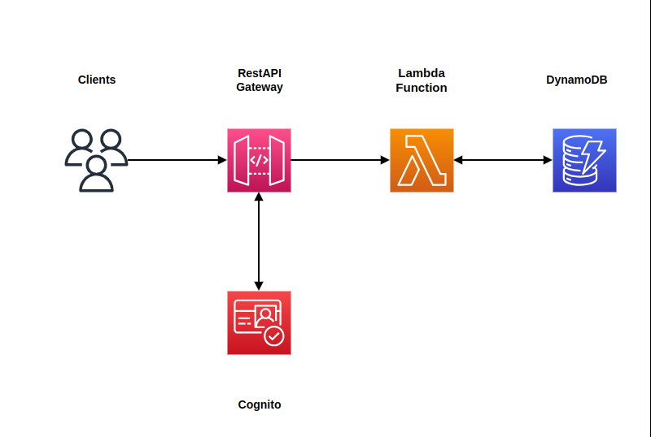

# SAM Serverless architecture made by Nettune057

This is the SAM example for Rest API - Cognito - Lambda - DynamoDB

## Architecture Diagram

## Progresses

### 24/7/2023 
Completed Rest API - Cognito -Lambda - DynamoDB, ready for authorization with Cognito

### 25/7/2023
Researched Cognito 

## Test Usage
curl -X "PUT" -H "Content-Type: application/json" -d "{\"id\": \"123\", \"price\": 12345, \"name\": \"myitem\"}" https://{apiID}.execute-api.us-east-2.amazonaws.com/Prod/items

export COGNITO_USER_EMAIL='a@gmail.com'

sam deploy --parameter-overrides CognitoUserEmail=$COGNITO_USER_EMAIL

aws cognito-idp admin-set-user-password --user-pool-id --username  --password --permanent

aws cognito-idp initiate-auth --auth-flow USER_PASSWORD_AUTH --auth-parameters "USERNAME=$COGNITO_USER_EMAIL,PASSWORD=" --client-id 
