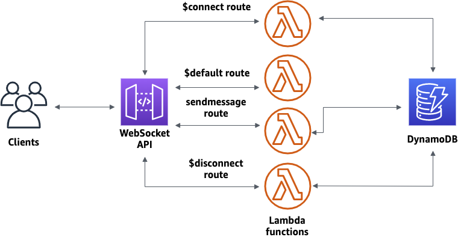

# Web socket architecture terraform example made by TungNT

    This is my first arhitecture that its usecase is for Websocket API gateway messaging serverless app.

## Architecture Diagram

    First, you'll create Lambda functions that will handle API requests, as well as a DynamoDB table that stores your client IDs. Then, you'll use the API Gateway console to create a WebSocket API that integrates with your Lambda functions. Lastly, you'll test your API to verify that messages are sent and received.

## Use case

Have a Websocket API gateway to route message traffic to functions that serves different purposes

## Progress

### 14/7/2023
Researched about the architecture and created Terraform remote backend, Websocket API gateway.

## License
[MIT](https://choosealicense.com/licenses/mit/)